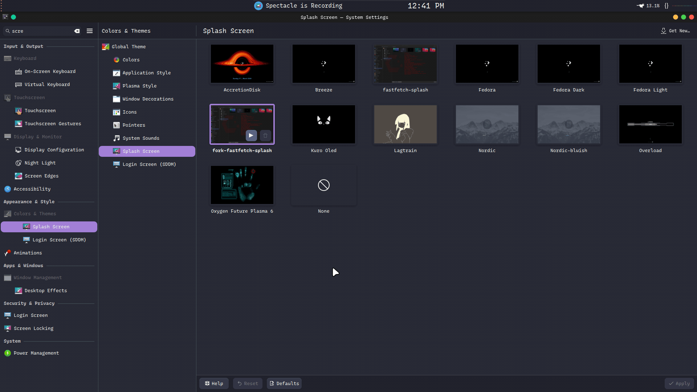
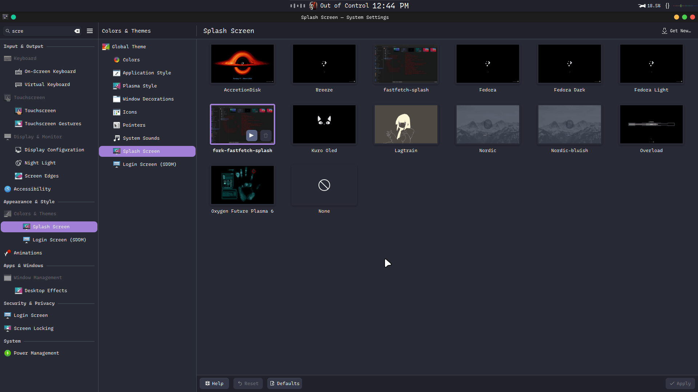

<div align="center">

<!-- USER: Optional logo — drop one at assets/logo.png and uncomment -->
<!--  -->

# Fastfetch KDE Splash (Fork)

### Matrix-style boot splash for KDE Plasma that shows your real system info — in full color

A fork of [herzane52/fastfetch-kde-splash](https://github.com/herzane52/fastfetch-kde-splash) that renders `fastfetch` output on your Plasma splash screen with a glitch character-reveal animation — and, unlike the original, **preserves your terminal's ANSI colors** (256-color and truecolor) exactly as fastfetch prints them.

[](LICENSE)
[](https://github.com/DeadIndian/fastfetch-kde-splash/releases)
[](https://github.com/DeadIndian/fastfetch-kde-splash/stargazers)
[](https://github.com/DeadIndian/fastfetch-kde-splash/pulls)
[](contents/splash/Splash.qml)

[Getting Started](#-installation) ·
[Features](#-features) ·
[Configuration](#-configuration) ·
[Report Bug](https://github.com/DeadIndian/fastfetch-kde-splash/issues)

<!-- USER: Hero GIF — record the splash in action and save it as
     assets/screenshots/hero.gif (existing recordings live at repo root:
     video1.gif, video2.gif) -->
<p>
  
</p>
<sub><i>Placeholder — replace <code>assets/screenshots/hero.gif</code> with your recording</i></sub>

</div>

---

## 📖 Table of Contents

- [About](#-about)
- [Features](#-features)
- [Demo](#-demo)
- [Requirements](#-requirements)
- [Installation](#-installation)
- [Configuration](#-configuration)
- [Changing Settings Later](#-changing-settings-later)
- [Uninstallation](#-uninstallation)
- [Contributing](#-contributing)
- [License](#-license)
- [Acknowledgments](#-acknowledgments)

---

## 🎯 About

Instead of a static spinner, your boot splash shows live `fastfetch` output — OS logo and system info — decoded character by character in random "glitch" order, like a terminal hacking scene. The splash ends automatically as soon as your desktop is ready.

This fork builds on herzane's original with two headline additions: a **full ANSI color pipeline** (the splash matches your terminal's fastfetch colors, including 24-bit truecolor) and a **sequential layout mode** where the logo decodes center-screen, slides left, and the info fades in. It also carries everything the original gained in v1.5: animation speed presets, an info-only layout, and a translated installer.

## ✨ Features

- **True ANSI colors** — standard 16, 256-color, and 24-bit truecolor SGR sequences parsed and rendered as-is; no stripped single-color output
- **4 layout modes** — logo only, logo + info (full), sequential (logo reveals then slides left while info fades in), info only
- **Glitch reveal animation** — characters decode in random order (Fisher–Yates shuffle), layout preserved while hidden
- **Animation speed control** — fast / normal / slow presets, or fully custom timing (glitch interval, intro/exit durations, minimum splash time, chars-per-frame)
- **Theme color & background** — glow color and background (any HEX or transparent) set during install
- **Interactive installer wizard** — plain `bash`, no dependencies; auto-detects your language (`lang/` files, easy to translate)
- **Robust error handling** — safety timer catches missing/failed fastfetch and shows a readable error on the splash instead of hanging

## 📸 Demo

<!-- USER: One GIF per layout mode. Record each mode by setting it in install.sh,
     logging out, and recording the splash. Save to assets/screenshots/. -->

| Logo only | Full (logo + info) |
| :---: | :---: |
|  |  |
| <sub><i>placeholder: mode-logo.gif</i></sub> | <sub><i>placeholder: mode-full.gif</i></sub> |

| Sequential | Info only |
| :---: | :---: |
|  |  |
| <sub><i>placeholder: mode-sequential.gif</i></sub> | <sub><i>placeholder: mode-info.gif</i></sub> |

## 📋 Requirements

- **KDE Plasma 6** (uses `Qt5Compat.GraphicalEffects` / `plasma5support`)
- **[fastfetch](https://github.com/fastfetch-cli/fastfetch)** installed and in `PATH`
- `bash` (for the installer)

## 🚀 Installation

```bash
# 1. Make sure fastfetch is installed
#    Fedora: sudo dnf install fastfetch
#    Arch:   sudo pacman -S fastfetch
#    Debian/Ubuntu: sudo apt install fastfetch

# 2. Clone and run the installer
git clone https://github.com/DeadIndian/fastfetch-kde-splash.git
cd fastfetch-kde-splash
chmod +x install.sh
./install.sh
```

The installer walks you through four questions — theme color, layout, background, and animation speed — then installs to `~/.local/share/plasma/look-and-feel/fork-fastfetch-splash/`.

**Activate it:** *System Settings → Appearance → Splash Screen → **fork-fastfetch-splash*** → Apply. Log out and back in to see it.

## 💻 Usage

There's nothing to run day-to-day — the splash activates at login. To preview changes, just log out and back in.

## ⚙️ Configuration

All configuration happens through the installer (`./install.sh`). The four questions:

| Setting | Options |
| --- | --- |
| Theme color | none (**default** — pure fastfetch colors, no glow) · red / blue / green / cyan, or any HEX (e.g. `#637C76`) — glow only; text colors always come from fastfetch |
| Layout | `logo` (OS logo only) · `full` (logo + info) · `info` (system info only) · `sequential` (logo reveals, slides left, info fades in) |
| Background | black / transparent, or any HEX |
| Speed | normal / fast / slow, or custom values for glitch interval, intro & exit durations, minimum splash duration, frame divisor |

The installer writes your choices directly into the installed `Splash.qml` (see below).

<details>
<summary>Speed preset values</summary>

| Preset | Glitch interval | Intro | Exit | Min duration | Frame divisor |
| --- | --- | --- | --- | --- | --- |
| Fast | 15 ms | 400 ms | 800 ms | 2500 ms | 25 |
| Normal | 30 ms | 800 ms | 1500 ms | 4000 ms | 50 |
| Slow | 50 ms | 1500 ms | 3000 ms | 6000 ms | 100 |

</details>

## 🔧 Changing Settings Later

Re-run the installer any time:

```bash
./install.sh
```

Or edit the installed QML directly:

```bash
nano ~/.local/share/plasma/look-and-feel/fork-fastfetch-splash/contents/splash/Splash.qml
```

The properties at the top of `Splash.qml` are the full set of knobs:

| Property | Description | Default |
| --- | --- | --- |
| `themeColor` | Glow color (HEX) | `#ff0000` |
| `glowEnabled` | Glow on/off — `false` = pure fastfetch colors | `false` |
| `displayMode` | `logo` / `full` / `sequential` / `info` | `logo` |
| `bgColor` | Background (HEX or `transparent`) | `#000000` |
| `glitchInterval` | Reveal timer interval, smaller = faster (ms) | `30` |
| `introDuration` | Fade-in duration (ms) | `800` |
| `exitDuration` | Fade-out duration (ms) | `1500` |
| `minSplashDuration` | Minimum visible time (ms) | `4000` |
| `frameDivisor` | Chars revealed per frame divisor, smaller = faster | `50` |

### Adding installer languages

The installer auto-detects your `$LANG` and loads a matching file from `lang/`. To add one:

```bash
cp lang/en.sh lang/de.sh   # then translate the MSG_* and SPEED_* strings
LANG=de_DE ./install.sh    # test
```

## 🗑️ Uninstallation

```bash
rm -rf ~/.local/share/plasma/look-and-feel/fork-fastfetch-splash
```

Then pick another splash in System Settings.

## 🤝 Contributing

Contributions welcome — new layout modes, more installer languages, and bug fixes are all good PRs.

1. Fork the repo
2. Create your branch (`git checkout -b feature/amazing`)
3. Commit (`git commit -m 'Add amazing feature'`)
4. Push (`git push origin feature/amazing`)
5. Open a Pull Request

## 📄 License

MIT — see [LICENSE](LICENSE). Contains code from the upstream project by [herzane](https://github.com/herzane52), also MIT.

## 🙏 Acknowledgments

- **[herzane52/fastfetch-kde-splash](https://github.com/herzane52/fastfetch-kde-splash)** — the original this fork builds on
- **[fastfetch-cli/fastfetch](https://github.com/fastfetch-cli/fastfetch)** — the system info tool that powers the splash

---

<div align="center">
<sub>Built with ❤️ by <a href="https://github.com/DeadIndian">DeadIndian</a></sub>
</div>
